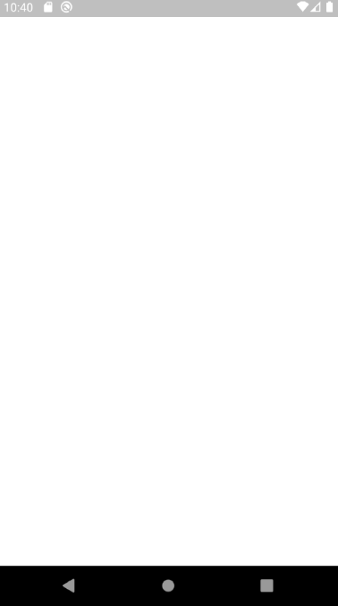

# Weather App

The goal of this project was to create a Flutter application that is capable of displaying weather information for the current city or a searched city. This project was created with the guidance of [Linkedin Learning Course](https://www.linkedin.com/learning/flutter-part-08-powering-your-app-with-live-web-data/clima-a-modern-weather-app)

## Demo

  

